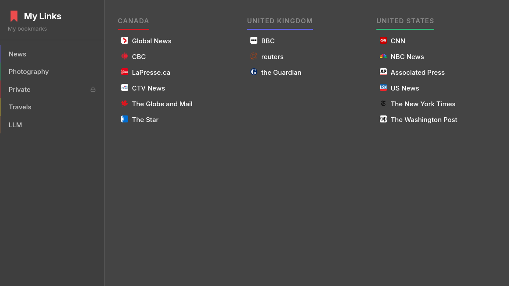
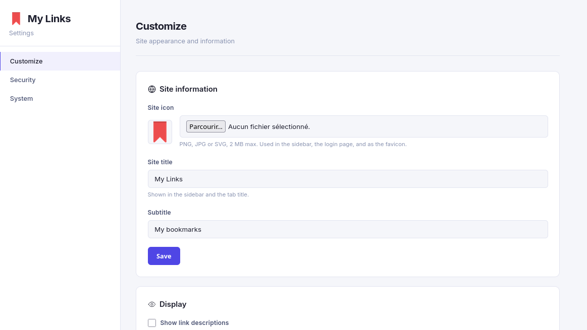

# Links App

A self-hosted, lightweight bookmark manager written in plain PHP and MySQL/MariaDB : no framework, no build step, no dependencies. Organize your links into categories and subcategories, optionally lock sensitive categories behind a PIN code, and browse everything through a clean, fast, searchable interface that works just as well on a phone as on a desktop.



## Features

- **Categories & subcategories** : organize links in a two-level hierarchy, fully drag-and-drop reorderable.
- **Automatic metadata fetching** : paste a URL and the title/description are fetched for you (with SSRF protection).
- **Favicon caching** : favicons are downloaded once and served locally instead of hot-linking on every page view.
- **Search** : instant search across all your links (admin and public site).
- **PIN-protected categories** : lock specific categories behind a 4-digit PIN, independent expiry per category.
- **Light/dark theme** : flash-free theme switching, respects system preference by default.
- **Multi-language interface** : French and English included out of the box; adding a new language is a single file (see [Adding a language](#adding-a-language)).
- **Single admin account** : simple password-based admin login, no user management overhead for a personal tool.
- **JSON export** : back up all your categories, subcategories, and links in one click.
- **No framework, no build step** : plain PHP 8, vanilla JS, hand-written CSS. Deploy by copying files to a web server.



## Requirements

- PHP 8.0 or later, with the `pdo_mysql` and `curl` (or `allow_url_fopen`) extensions enabled.
- MySQL 5.7+ or MariaDB 10.3+.
- Apache or LiteSpeed with `mod_rewrite`/`mod_headers`/`mod_expires`/`mod_deflate` recommended (a ready-to-use `.htaccess` is included). Nginx works too, but you'll need to translate the `.htaccess` rules into your server block yourself.

## Installation

1. **Get the code**
   ```bash
   git clone https://github.com/<your-username>/<your-repo>.git
   cd <your-repo>
   ```

2. **Create the database**

   Create an empty MySQL/MariaDB database and a user with full privileges on it, then import the schema:
   ```bash
   mysql -u youruser -p your_database_name < install.sql
   ```
   This creates the four required tables (`categories`, `subcategories`, `links`, `settings`) and seeds a default admin password of `admin` : you'll be prompted to change it as soon as you log in.

3. **Configure the app**

   Copy the configuration template and edit it with your own values:
   ```bash
   cp config.example.php config.php
   ```
   Open `config.php` and set:
   - `DB_HOST`, `DB_NAME`, `DB_USER`, `DB_PASS` : your database credentials.
   - `BASE_URL` : the full URL where the app will be served, no trailing slash (e.g. `https://links.example.com`).
   - `SESSION_SECRET` : a long random string used to sign PIN-unlock cookies. Generate one with:
     ```bash
     php -r "echo bin2hex(random_bytes(32));"
     ```

   `config.php` is listed in `.gitignore` on purpose : never commit it.

4. **Set permissions**

   The app needs to write uploaded site icons and cached favicons:
   ```bash
   chmod -R 755 assets/uploads
   ```

5. **Point your web server** at the project's root directory (where `index.php` lives). The included `.htaccess` already blocks direct access to `config.php`, sets security headers, and enables caching/compression for Apache/LiteSpeed.

6. **Log in**

   Visit `https://your-domain/admin/`, log in with the default password `admin`, and immediately change it from **Settings → Security**. While you're there, you can also set a PIN code for locked categories and pick your interface language.

## Adding a language

Translations live as plain PHP files in `includes/lang/`. Each file returns an associative array of translation keys, plus an optional `_meta.name` entry used as the display name in the language picker.

To add a new language:

1. Copy `includes/lang/en.php` to `includes/lang/<code>.php` (e.g. `es.php` for Spanish).
2. Translate every value (keep the keys unchanged).
3. Update `_meta.name` to the language's display name.

That's it : the new language appears automatically in **Settings → Customize → Display**, no other code change required.

## Project structure

```
.
├── admin/                  # Admin interface (category/link management, settings)
├── assets/
│   ├── css/                # Stylesheets (public site + admin)
│   ├── js/                 # Vanilla JS (public site + admin)
│   └── uploads/             # Site icon + cached favicons (gitignored, created at runtime)
├── includes/
│   ├── lang/                # Translation files (fr.php, en.php, ...)
│   ├── db.php                # PDO connection + shared helpers (i18n, rendering, settings)
│   ├── auth.php              # Admin session management
│   └── icons.php              # Inline SVG icons
├── config.example.php       # Configuration template : copy to config.php
├── install.sql               # Database schema + default admin seed
├── index.php                  # Public site
├── favicon.php                 # Local favicon cache/proxy
└── verify-pin.php               # PIN-unlock endpoint for locked categories
```

## Security notes

- The default admin password (`admin`) must be changed on first login : the admin panel will keep warning you until you do.
- `config.php` is excluded from version control; never commit real credentials or your `SESSION_SECRET`.
- Outbound URL fetching (metadata + favicons) is protected against SSRF: private/reserved IP ranges and non-HTTP(S) schemes are rejected.
- PIN-protected categories use a signed, HttpOnly cookie with a configurable expiry : the PIN itself is never stored client-side.

## License

This project doesn't ship with a license file yet : add one (MIT is a common choice for a project like this) before making the repository public if you want to clarify how others may use the code.
